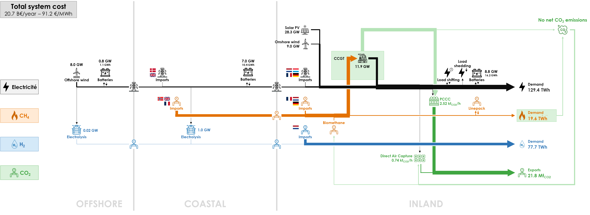

Achieving carbon neutrality in 2050 is feasible, with minimal unmet demand (“Energy Not Served”). However, it requires a large amount of CH4 and H2 imports. In total, 200.5 TWh of molecules are imported, constituting 58% of the total annual energy demand. 97.8% of hydrogen is imported because of the limited renewable electricity available for hydrogen production in Belgium. The remaining fraction of hydrogen is produced in the COASTAL cluster, converting electricity generated from offshore wind turbines and solar PV from the INLAND cluster.

Both offshore and onshore wind energy are deployed at their maximum potential with capacity factors of 22.6% and 38.2% respectively. Interestingly, carbon neutrality is reached without fully exploiting the solar PV potential, due to its lower capacity factor of 11.6% and the limit on the power grid capacity. The biomethane production potential is fully deployed.

Direct Air Capture (DAC) is required to attain carbon neutrality. Post-Combustion Carbon Capture (PCCC) is used nearly at full capacity. The total system cost stands at €20.39 billion per year, equivalent to an average cost of €89.34/MWh: €[]/MWh for electricity, €[]/MWh for methane and €[]/MWh for hydrogen.

The detailed results of the base case are presented in the following sections:

- **Energy Balances**: balance of input (production, import, output of conversion) and output (final demand, export, input of conversion) for electricity, hydrogen and methane – per year, month, day or hour;
- **Capacities**: for each technology related to the production, transport, storage or conversion of electricity, hydrogen and methane, capacity to install in the optimal energy system;
- **CO2 Balance**: balance of CO2 emissions (methane used as final consumption and power plants)- and CO2 withdrawals (carbon capture, bio-energy);
- **Cost Overview**: annualized cost for each technology related to the production, transport, storage or conversion of electricity, hydrogen, methane and CO2;
- **Energy Storage**: for each storage technology of electricity, hydrogen and methane, storage capacity to install;
- **Marginal Costs**: electricity, methane and hydrogen cost/price hour by hour in a perfect market where the marginal supply balances the marginal demand; for CO2 it provides a yearly abatement cost.

