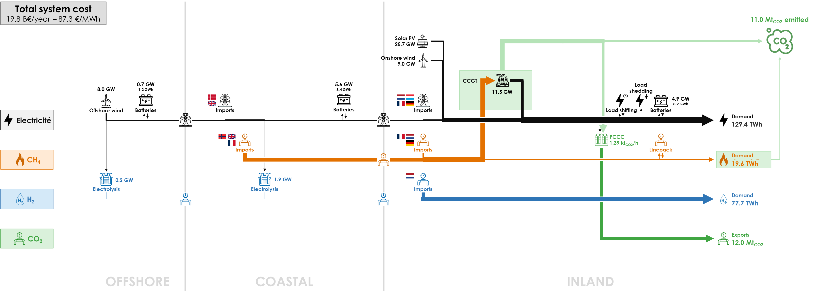
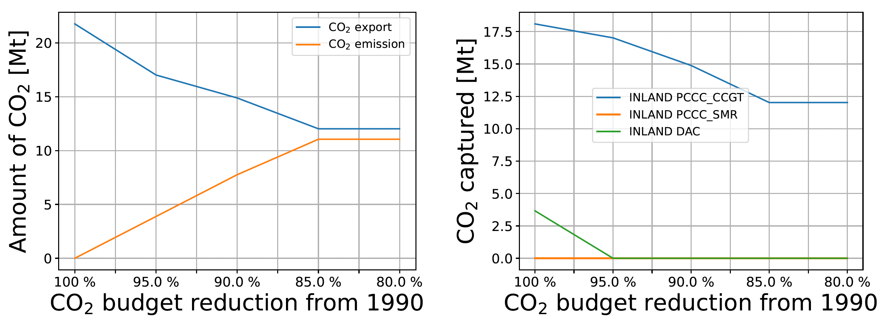
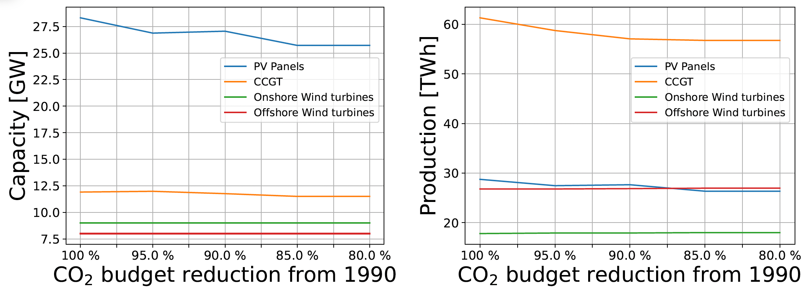
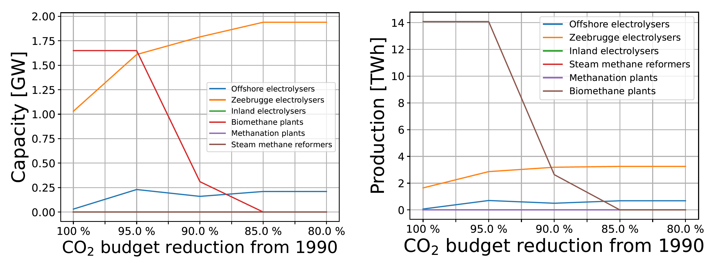

The Base Case assumes a net-zero energy system by 2050. But the Belgian energy system is integrated within the European energy market and the decarbonisation cost may be different across countries. Therefore, some countries have net-positive emissions, while others have net-negative emissions in an optimal EU energy system. In this sensitivity, we analyse how the system changes If some CO2 emissions are allowed for Belgium in 2050, from 0% (Base Case) to 20% of the 1990 emissions (77 MtCO2).

If CO2 emissions are allowed, they will take place up to 15% of historical emissions, as shown on the left part in the figure below. This shows that the CO2 Budget is actually a constraint from 0% to 15%. In that same graph we show that CO2 export decrease simultaneously, but they stabilize at [12] MtCO2/y instead of [23] MtCO2/y in the Base Case. The right part of the figure shows that DAC is not used above 5% and that PCCC on CCGTs decreases to [12] MtCO2/y instead of [18] MTCO2/y.

The other technologies of the energy system show rather minor changes for a CO2 budget between 0% to 20%. In the left part of the figure below, we see that solar PV capacity slightly decreases to [] GW from 28.3 GW in the Base Case. CCGTs decrease accordingly to [] GW from 11.9 GW. Electricity production from solar PV and CCGTs decrease accordingly (right part of figure below).

The biomethane capacity potential ([1.6] GW) was fully deployed in the Base Case, but after 5% of CO2 budget, this capacity is reduced to 0 at 15% (see left side of figure hereunder). Production of those biomethane plants decrease accordingly from [14 TWh] in the Base Case to 0 after 15% of CO2 Budget (see right side of figure hereunder). Electrolysis capacity in the COASTAL cluster double to [2] GW from [1] GW in the Base Case for a CO2 Budget of 20% instead of 0. The production of those electrolysers double as well.

[Impact on system cost: to add…]

All results can be visualised in the [Interactive Results section](../all_simulations) by selecting a “CO2 Budget” scenario with the specified CO2 budget in % with respect to 1990.