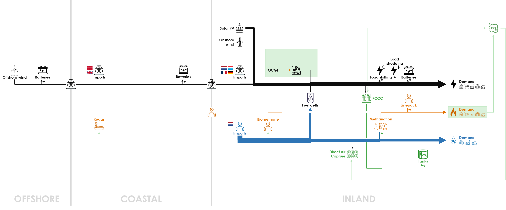
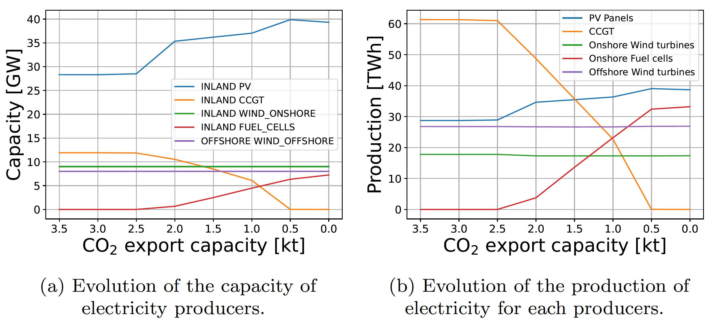
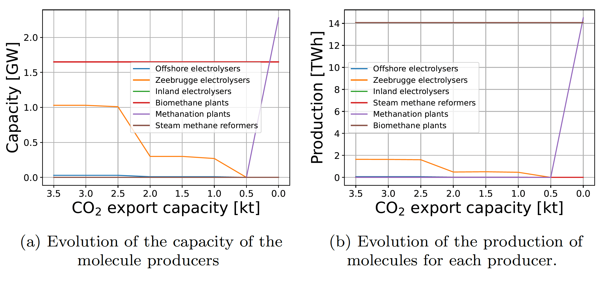
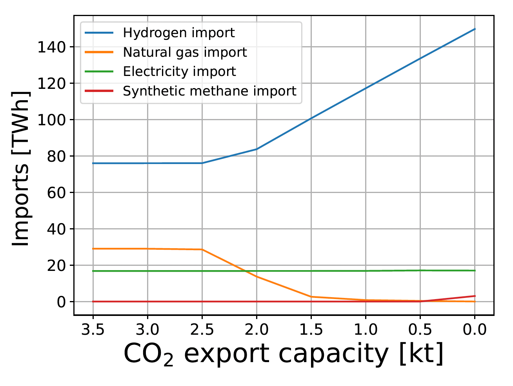

The capacity to export CO2 by pipeline strongly impacts the deployment of renewable electricity in Belgium’s net-zero energy system in 2050. When this capacity decreases, less CO2 emissions is allowed, so that CCGTs are less used and more electricity is imported. In the extreme case shown below, no CO2 can be exported, CCGTs are seldom used and the captured CO2 is even used in methanation facilities to produced CH4 needed for final demand.

When the constraint on CO2 export capacity is reduced from 3.5 kt/h in the Base Case down to 0, the amount of exported CO2 is unchanged till 2.5 kt/h, and then decreases simultaneously with the decreasing capacity (see figure below). This showcases that this constraint is not reached in the Base Case, but that it impacts the energy system between 2.5 kt/h and 0.

  2 exports" src="../../img/evol_co2_export_capa.png" style="max-width: 500px;">

The electricity system is strongly impacted when the CO2 export capacity is reduced. In the left side of the figure below, we see that solar PV capacity increases to [] GW from 28.3 GW in the Base Case. CCGT capacity is reduced to 0 when the CO2 export capacity is lower than 0.5 kt/h. Dispatchable electricity is provided by [] GW fuel cells, while no fuel cells were installed in the Base Case.

On the right side of the figure below, we see that the production of CCGTs is strongly reduced from 61.3 GWh in the Base Case down to 2.5 kt/h to 0 at 0.5 kt/h. This is compensated by a higher production of solar PV to [] GWh from [] GWh in the Base Case, while fuel cells produce [] GWh of dispatchable electricity below a CO2 export capacity of 0.5 kt/h.

Significant changes also take place in the hydrogen and methane systems. In the left side of the figure below, we see that electrolysers are less deployed in the COASTAL cluster, because more electricity has to be used directly (through batteries) instead of from CCGTs. For a constraint of 0.5 to 0 kt/h, we see the appearance of a strong methanation capacity of [] GW that produces [GWh] at 0 kt/h. Methanation supplies the full final CH4 demand instead of imports.

The next figure shows that electricity imports remain stable when the CO2 export capacity is reduced from 3.5 kt/h to 0, while methane imports are reduced from [] TWh to 0 because the CO2 emissions could not be exported anymore. The whole energy system then relies on increasing imports of hydrogen that is used directly or converted to electricity through fuel cells. Hydrogen imports double to [] TWh with no CO2 export capacity from [] TWh in the Base Case.

  

As the CO2 export capacity is reduced, and less CCGTs are deployed, PCCC decrease as well. The figure below shows that CO2 captured from CCGTs decreases to 0 for a CO2 export capacity of 0-0.5 kt/h from [] MtCO2 in the Base Case.

  2 captured" src="../../img/evol_co2_captured.png" style="max-width: 500px;">

[Impact on system cost: to add…]

All results can be visualised in the [Interactive Results section](../all_simulations) by selecting a “CO2 Export Capacity” scenario with the specified CO2 export capacity in kt/h.