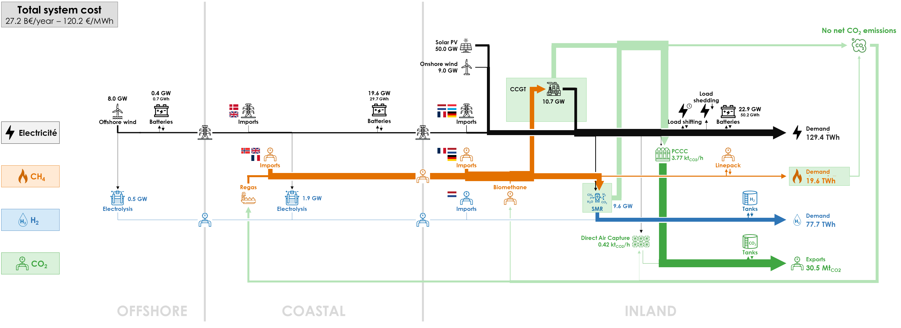
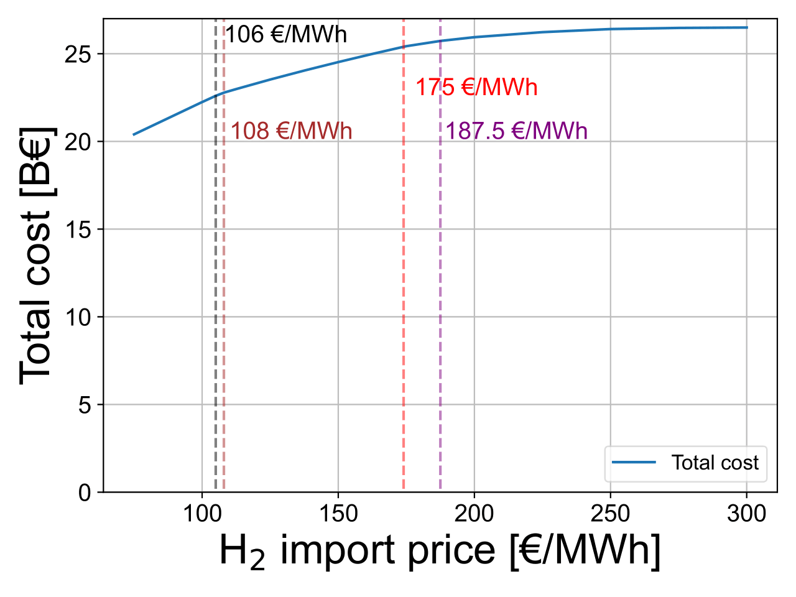

The production and transportation costs of hydrogen are key in the decision to use electricity or hydrogen for bringing offshore energy to markets. It is therefore important to study the behavior of factors that influence these costs. 

In this sensitivity analysis, we analyse the impact of the H2 import price is assessed, which can help identify a threshold beyond which importation is no longer profitable compared to offshore or onshore hydrogen production. 

Here is the diagram with the deployed technologies and the commodity flows in the optimal energy system with a H2 import cost of €300/MWh instead of €75/MWh:

We explore a hydrogen import cost ranging from €75/MWh (Base Case) to €300/MWh, equivalent to €2.5/kg (Base Case) to €10/kg, in order to understand how hydrogen demand is fulfilled – trade-off between domestic production and imports, trade-off between electrolysis and SMRs with carbon capture – and assess its impact on CO2 emissions and electricity production.

The middle part of the next figure shows that the amount of imported hydrogen decreases as the price of importing H2 increases, dwindling to a negligible amount at €300/MWh from 76.0 TWh or 98% of the hydrogen system in the Base Case.

In the OFFSHORE cluster, raising the cost of H2 imports initially boosts the production of electrolysers, as depicted in the central part of the next figure. At €108/MWh, electrolysis plants in the OFFSHORE cluster hit a peak capacity at 580 MW, producing 1.9 TWh of hydrogen. Consequently, the required capacity for electricity transmission lines between the OFFSHORE and COASTAL clusters decreases to 3.8 GW from 4.5 GW in the Base Case. Hydrogen production from offshore wind remains quite low across the range of analysed H2 import costs because of the lack of renewable electricity potential with respect to electricity demand.

  

    2 elec prod" src="../../img/DAC_cost_h2_h2_cap-1.png">
  

  

    2 ng import" src="../../img/DAC_cost_h2_h2_tot_prod-1.png">
  

  

    2 obj" src="../../img/DAC_cost_h2_inter_cap-1.png">
  

However, at a price of €108/MWh, the majority of hydrogen is still produced in the COASTAL cluster, with a capacity of 2.7 GW and a production of 4.5 TWh, compared to 1.0 GW and a production of 1.6 TWh in the base case at €75/MWh. Most of the hydrogen remains imported.

Between €105 and €108/MWh, steam methane reformers become cheaper to produce H2 from CH4. SMRs immediately produce a significant part of hydrogen demand: from 24.5 TWh or 32% at €108/MWh to 71.8 TWh or 92% at €300/MWh. However, additional CO2 emissions from SMRs increase the costs linked to the capture of CO2 emissions (PCCC on CCGTs and SMRs, DAC). As hydrogen is increasingly produced by SMRs, CCGTs are less used because of limited CO2 exports, and solar PV capacity and production is increased to supply the electricity system, as illustrated in the middle side of the next figure.

  

    2 elec prod" src="../../img/DAC_cost_h2_elec_prod-1.png">
  

  

    2 ng import" src="../../img/DAC_cost_h2_ng_imp-1.png">
  

  

    
  

When the H2 import price reaches €108/MWh, the CO2 export limit is reached, resulting in a balance between the production of CCGT and SMRs. Between €108/MWh and €187.5/MWh, an increase in SMR production causes a decrease in electricity generated from CCGTs. To compensate for the shortage, solar PV generates more electricity, while electrolysers produce slightly less. Beyond €174/MWh, it becomes profitable to import synthetic methane, enabling SMRs to produce hydrogen without capturing all emitted CO2.

At €187.5/MWh, solar PVs reach their maximum potential capacity capacity of 50 GW, instead of 28.3 GW in the Base Case. The production from solar PV (after curtailment) increases to 43.1 TWh at €300/MWh instead of 28.7 TWh in the Base Case, but the load factor decreases from 11.6% to 9.9% as curtailment increases with the rising discrepancy between electricity supply and demand. To offset the reduced CCGT production, less hydrogen is produced from green electricity. Imports of synthetic methane further increase to produce hydrogen by SMRs. Around €300/MWh, only a negligible amount of hydrogen is imported, with the majority being produced by SMRs.

These drastic changes in the energy system as the H2 import cost rises from €75/MWh to €300/MWh lead to a strong increase of the total energy cost: from €20.7 billion per year at €75/MWh to €22.9 billion at €108/MWh, to €25.4 billion at €162.5/MWh, and to [???] at €300/MWh.

All results can be visualised in the [Interactive Results section](../all_simulations) by selecting a “H2 Import Cost” scenario with the specified H2 import cost.