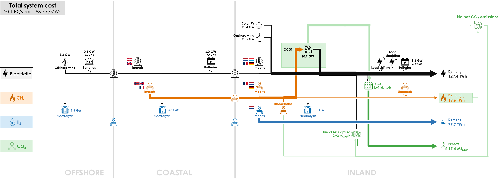

As the potential of wind onshore and wind offshore is fully installed in the base case, this sensitivity analyses whether higher capacities would be installed in an optimal energy system if the potential would be higher. 

All parameters are identical to the Base Case, except the potential for renewable electricity in Belgium in 2050, which is now set according to an [Energyville study](../../methodology/#notes):

|                | High Renewable (GW) | Base Case (GW) |
|----------------|---------------------|----------------|
| Solar PV       | 103.3               | 50             |         
| Onshore wind   | 20.5                | 9              |  
| Offshore wind  | 9.3                 | 8              |

Here is the diagram with the deployed technologies and the commodity flows in the optimal energy system with the assumptions of the High Renewable case:

The full potential of onshore wind (9.3 GW) and offshore wind (20.5 GW) is deployed. Solar PV remains limited to 28.5 GW, due to the limitation of curtailment and power on the electricity grid.

Consequently the production of renewable electricity (after curtailment) raises to 100.8 TWh from 73.3 TWh in the Base Case. There is a decrease in CCGT production to 48.4 TWh from 61.3 TWh in the Base Case.

Hydrogen production in the OFFSHORE cluster becomes significant, reaching 5.5 TWh, a stark contrast to its negligible presence in the Base Case. This is a notable rise in energy from offshore sources directly converted into hydrogen. Consequently, 1.6 GW of electrolyzers are deployed in the OFFSHORE cluster. It is connected to the COASTAL cluster through a 1.6 GW-hydrogen pipeline.

In the COASTAL cluster, the electrolyzer capacity increases to 3.3 GW from 1.0 GW in the Base Case, leading to a fourfold increase in hydrogen production of 6.9 TWh instead of 1.6 TWh in the Base Case. This boost stems from the increased generation of green electricity. It is interconnected to the INLAND cluster through a 4.9 GW-pipeline, instead of 1.1 GW.

The capacities of HVAC lines are slightly affected: the electricity line from the OFFSHORE cluster to the COASTAL cluster has a capacity of 5.9 GW instead of 6.8 GW in the Base Case; and the electricity interconnector from the COASTAL cluster to the INLAND cluster has a capacity of 5.7 GW instead of 6.5 GW.

With more intermittent renewables, the capacity of batteries increases by 30-50% in the OFFSHORE, COASTAL and INLAND clusters, to 2.0, 14.4 and 23.8 GWh, respectively. Hydrogen imports decrease to 65.0 TWh from 76.0 TWh in the Base Case as more hydrogen is produced domestically through electrolysis. Natural gas imports also decrease to 86.2 TWh from 107.8 TWh in the Base Case due to a lower use in electricity generation. However, the volume of electricity imported remains similar.

With less CCGT production, the amount of CO2 captured by PCCC is reduced to 13.7 Mt of CO2 from 18.1 Mt of CO2 in the Base Case. As less CO2 is emitted by CCGTs, less CO2 is captured and exported to Norway: 17.4 Mt of CO2 instead of 21.8 Mt. Therefore CO2 capture and export is an optimal way of achieving carbon neutrality in the Base Case when domestic renewable production is limited.

The total system cost is 3% lower: €20.1 billion per year instead of €20.7 billion of the Base Case. The cost per technology has the same trends as in the Base Case, with an additional cost for offshore wind and electrolysers, but a lower cost for the hydrogen imports and for the carbon capture value chain. The lower system cost results in a lower average energy cost of €88.7/MWh instead of €91.2/MWh. This is roughly 5% lower than in the Base Case.

All the results can be visualised in the [Interactive Results](../all_simulations) section by selecting the "High Renewable" scenario. 