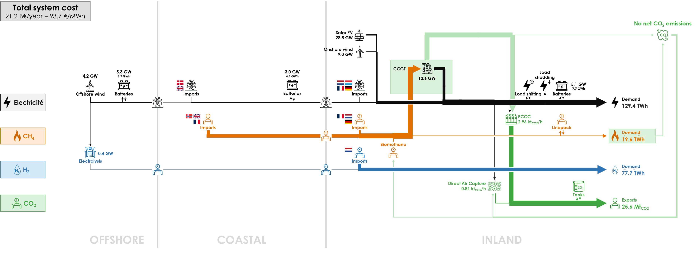

The production and transportation costs of hydrogen are key in the decision to use electricity or hydrogen for offshore energy transport. It is therefore important to study the behavior of factors that influence these costs. In this sensitivity analysis, we analyse the impact of the distance between the OFFSHORE and COASTAL clusters to determine if there exists a distance for which hydrogen pipelines lead to a cheaper energy system than electrical lines. We keep the offshore wind potential at 8 GW as in the Base Case. Analysis of the Belgian system with offshore wind located 1000 km from the shore instead of 40 km:

In the base case, the distance for HVAC lines between the OFFSHORE and COASTAL clusters was 40 km. In following simulations, HVAC lines are used for distances between 40 and 80 km. Above 80 km HVDC lines are used. The range selected for the distance varies from 40 to 1000 km.

As the distance increases, the cost difference between HV lines and hydrogen pipelines becomes more pronounced. Between 40 and 500 km, extending the distance between the OFFSHORE and COASTAL clusters favors offshore hydrogen production (from 0.11 TWh at 50 km to 3.2 TWh at 500 km) as illustrated in the top figure hereunder. Hydrogen production in the COASTAL cluster decreases, resulting in an overall rise in the total amount of H2 produced (from 1.7 TWh at 40 km to 3.3 TWh at 500 km). Despite the longer distances, most of the energy generated offshore is transported as electricity (23.1 out of 28.8 TWh at 500 km), while a substantial amount of hydrogen is still sourced from imports (74.4 TWh out of 77.7 TWh consumed at 500 km), because of the relatively cheaper import cost.

Beyond 500 km, offshore wind production starts to decline as it becomes more costly than importing it due to the cost of the transmission lines. At this point, there is a preference for electricity production from CCGT (as illustrated in the bottom figure hereunder) and importing hydrogen, which are cheaper solutions.

  

  

All results can be visualised in the [Interactive Results section](../all_simulations) by selecting a “Far Offshore Wind” scenario with the specified distance between the OFFSHORE and COASTAL clusters.